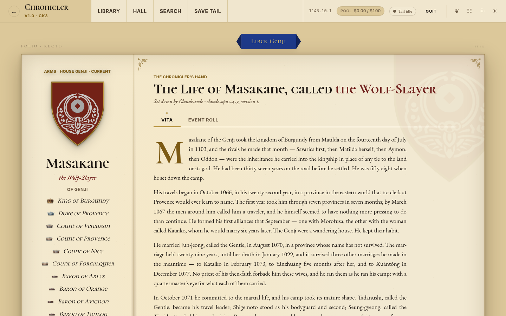

# CK3 LLM Chronicler

CK3 ships a character memory system that is technically a memory: a few flagged event
types, a date, a list of participants. It knows your heir's uncle was imprisoned in 1103.
It has no idea that this was the third brother he put in a cell, or that the man never
held a feast again afterwards.

Chronicler reads the save files instead. Every autosave is melted to JSON, diffed against
the previous one, and the resulting events land in a SQLite database per campaign. When a
character you track dies, their whole recorded life goes to an LLM as a briefing and comes
back as a biography, written into a git repo you own. The craft rules are strict about
invention: if a fact is not in the briefing, the sentence does not get written.

What that leaves after a long campaign is a folder of markdown that reads like a dynasty's
record of itself, plus a local web app to read it in. There is a codex per campaign, family
trees, the real in-game coats of arms lifted out of the game files, and a closing chronicle
that synthesises every biography when you retire the save.



*A sealed campaign, read back in the app. The provenance line under the title records which
model set it down and which version of the biography you are reading.*

Not affiliated with or endorsed by Paradox Interactive. Crusader Kings is their trademark;
this reads save files you already own.

Sealing a campaign writes a portable snapshot you can carry to another machine;
[docs/archived-campaigns.md](docs/archived-campaigns.md) covers that. For the
end-to-end narrative flow see [docs/biography-pipeline.md](docs/biography-pipeline.md);
for how the pieces fit together see [docs/architecture.md](docs/architecture.md). The
milestone-by-milestone changelog lives
in [docs/version-history.md](docs/version-history.md).

## Requirements

- **Crusader Kings III**, your own copy. Chronicler reads its saves; it does not need
  `-debug_mode` and it does not touch the game install except to borrow heraldry textures.
- **Autosaves set to MONTHLY** (Settings → Game). That interval is what makes the tailer
  feel live rather than quarterly.
- **One narrative backend**, whichever suits your billing:
  - a Claude subscription with the [`claude` CLI](https://claude.com/claude-code) on PATH
    (the default, and the one the craft rules were tuned against), or
  - an Anthropic API key, or
  - any OpenAI-compatible endpoint, which covers OpenAI, DeepSeek and OpenRouter as well
    as a local model behind Ollama or LM Studio.
- **[uv](https://docs.astral.sh/uv/) and Python 3.11+**, plus Node 18+ to build the frontend.
- **The `rakaly` CLI**, fetched per machine. On Linux `scripts/fetch-tools.sh` downloads it
  into the layout the runners expect; on Windows and macOS, grab the
  [release archive](https://github.com/rakaly/cli/releases/latest) and extract it to the
  repo root as `rakaly-<version>/`.

## Setup

```bash
uv sync                  # creates .venv and installs deps (incl. dev)

# Build the SPA (served by the FastAPI app from /):
cd frontend && npm install && npm run build && cd ..

# Wire the versioned git hooks into this clone (keeps the .memories/ index
# fresh; hooksPath is a per-clone local config, not versioned):
git config core.hooksPath .githooks

# Scaffold the chronicle directory your biographies get written into:
.venv/bin/chronicler init-prose
```

`init-prose` copies the bundled chronicle template (the `CLAUDE.md` craft rules, the
per-kind voice files, a worked example) into `<data dir>/prose`, git-inits it, and records
the path. It is safe to re-run: an existing chronicle directory is left alone, so your
edited rules survive. Point it somewhere else by passing a path, or set
`CHRONICLER_PROSE_REPO_PATH` if you already keep one. The Settings screen has the same
button if you would rather click it.

That directory is where the register lives, and it is the reason the prose reads as a
chronicle instead of as a helpful assistant summarising a spreadsheet. Editing
`CLAUDE.md` there is the intended way to change how your chronicle sounds. Generation
refuses to start without it rather than quietly producing generic prose.

Per-machine state (registry DB, per-campaign DBs, extracted heraldry, the chronicle
directory) lives at `~/Documents/chronicler/` on Windows and macOS or
`~/.local/share/chronicler/` on Linux, honouring `$XDG_DATA_HOME`. Override with
`CHRONICLER_DATA_DIR`. The CK3 save and log directories are likewise resolved per-OS
(Windows and macOS `~/Documents/Paradox Interactive/…`, Linux
`~/.local/share/Paradox Interactive/…`); override with `CHRONICLER_SAVE_DIR` and
`CK3_DEBUG_LOG`. Running CK3 through Proton? Point those at the Proton prefix.

### Choosing a backend

The default is `claude-code`, which shells out to the `claude` CLI and bills your
subscription's monthly programmatic credit pool. No API key is involved, and chronicler
strips `ANTHROPIC_API_KEY` out of that subprocess's environment on purpose so a stray key
in your shell cannot flip the CLI into pay-per-use billing behind your back.

The other two are picked in Settings → Provider & LLM, or with
`CHRONICLER_NARRATIVE_BACKEND=anthropic` / `=openai-compatible`. Keys and endpoints can be
saved from that screen (write-only: the UI reports that a key is stored and never shows it
back) or supplied as environment variables. Whichever you choose applies process-wide;
there is no per-request routing, so exactly one account is ever billed for a generation.
`chronicler doctor` reports which one is live and whether the others would work.

Honest caveat: the craft rules in the chronicle template were written and tested against
Claude. They are plain markdown and nothing about them is Claude-specific, but a small
local model will hold them less reliably, and that shows up as prose that drifts back
toward summary.

## Quickstart

```bash
# Create a campaign:
uv run chronicler campaign create my-campaign

# Auto-detect the player + immediate family from the latest save:
uv run chronicler auto-track --campaign my-campaign

# (Optional) backfill the full historical record from the save's vanilla
# memory events. Imports 50,000+ characters with names + dates. Idempotent:
uv run chronicler import-save \
    "~/Documents/Paradox Interactive/Crusader Kings III/save games/autosave.ck3" \
    --campaign my-campaign

# Run save-tail + web server in one terminal (the recommended loop):
uv run chronicler dev --campaign my-campaign
# Visit http://127.0.0.1:8000, the Save-tail screen shows live SSE events
# as they ingest; play CK3 normally and biographies land within minutes of a
# tracked character's death.
```

To run the web server alone (no ingest), use `uv run chronicler serve`. For frontend
hot-reload, run the backend (`chronicler dev`) and `cd frontend && npm run dev` (Vite at
:5173, proxying `/api` to :8000) in parallel, or use the one-shot launcher that does both
and opens a chromeless window: `LAUNCH.bat` (Windows) or `./launch.sh` (Linux/macOS).

For mod development there is also [`ck3-tiger`](https://github.com/amtep/ck3-tiger/releases),
which `fetch-tools` picks up alongside rakaly. Nothing in the normal loop needs it.

## CLI reference

- `chronicler init-prose [path]`: scaffold the chronicle directory. Safe to re-run.
- `chronicler doctor`: check the environment (CK3 install, backend, heraldry, campaigns).
- `chronicler campaign create <name>`: create a campaign DB.
- `chronicler auto-track --campaign <name>`: track the player + immediate family from the latest save.
- `chronicler save-tail --campaign <name>`: watch autosaves and ingest (primary transport). `--no-biography` disables generation.
- `chronicler import-save <path> --campaign <name>`: backfill full history from a save. Idempotent.
- `chronicler serve` / `chronicler dev --campaign <name>`: web server alone / web + save-tail.
- `chronicler track <id>` / `untrack <id>` / `tracked`: manage the opt-in tracked list.
- `chronicler dump-character <id>` / `dump-biography <id>`: inspect a character / its biography.
- `chronicler regenerate-biography <id>`: force regeneration against the events currently in the DB (useful for prompt iteration).

`chronicler --help` lists the full command surface, including the optional `-debug_mode`
`tail` flow documented in [docs/version-history.md](docs/version-history.md).

## API surface

The FastAPI backend serves the SPA from `/` and a JSON API under `/api/...` (campaigns,
characters, events, biography, family-tree, coa, tracked, cost-summary, closing-chronicle,
search, settings). Live updates stream over SSE at `/api/sse/ingest/{name}` and
`/api/sse/import/{import_id}`. The authoritative, always-current surface is the OpenAPI /
Swagger UI at `http://127.0.0.1:8000/docs`.

## Development

```bash
.venv/bin/python -m pytest -q            # full Python suite
uv run ruff check                        # lint
uv run ruff format                       # format

cd frontend
npm run test                             # vitest
npm run lint                             # eslint
npm run build                            # tsc -b && vite build
```

On Windows the interpreter is `.venv\Scripts\python.exe`. The package is installed editable
in that venv and not in the global Python, so run it from there.

The wire format and per-event-type schema are documented in
[docs/schema_versions.md](docs/schema_versions.md).

## Working on it

[CONTRIBUTING.md](CONTRIBUTING.md) has the setup, the exact gates CI runs on both Ubuntu and
Windows, how issues and dependencies are declared, and the one rule that outranks the rest:
the craft rules forbid invention. [docs/README.md](docs/README.md) indexes the rest.
[CLAUDE.md](CLAUDE.md) and [AGENTS.md](AGENTS.md) carry the same conventions for coding
agents.

## License

MIT. See [LICENSE](LICENSE).
